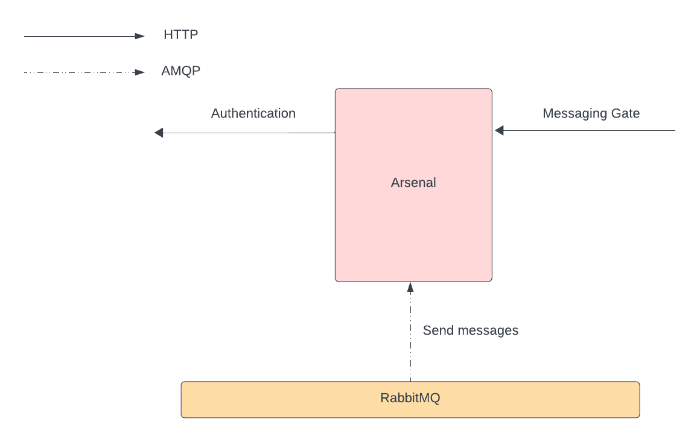

# LeLuChat_Arsenal
This is a Microservice of LeLuChat project, that store all chats, messages and rooms. It also
implements API for different operations of admin panel. This project is a part of whole LeLuchat 
project. You can follow it [here](https://github.com/amnik-open/LeLuChat).
## Development Environment
### Build Docker Image
`docker compose build`

### Test API
`docker compose run arsenal python manage.py test`

### Run Development Server
`docker compose up`

### REST API Design
Rest API design can be seen by Swagger UI 
[here](https://amnik-open.github.io/LeLuChat_Arsenal/).

